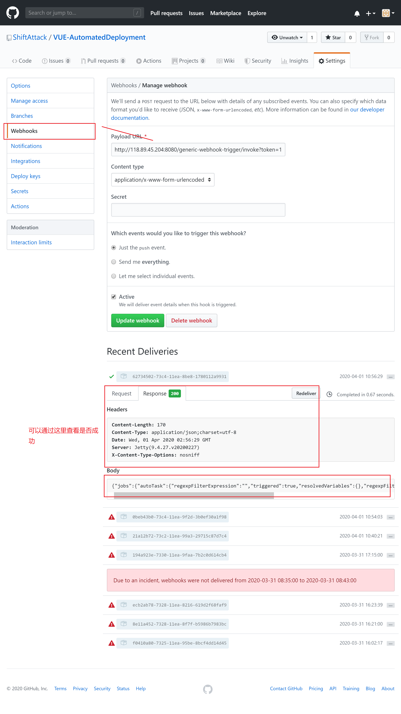

# Jenkins之前端VUE自动化打包发布

## 准备事项
- [一篇教程](https://juejin.im/post/5ad1980e6fb9a028c42ea1be)
- vue项目 （vue create demo）
- Gitlab / GitHub 项目托管平台
- 服务器 或 内网穿透
- 服务器配置相关环境（java）
- Jenkins


##  步骤
 1. 服务器配置java环境    
-  [centos7安装java](https://zixuephp.net/article-406.html)  
> 登录后直接   
  yum -y install java-1.8.0-openjdk   
  java -version(查看版本 有版本号就是安装成功)   
  安装完成

2. 安装Jenkins     
- [centos安装Jenkins](https://www.cnblogs.com/fangts/p/11095316.html)
 
> sudo wget -O /etc/yum.repos.d/jenkins.repo https://pkg.jenkins.io/redhat-stable/jenkins.repo     
sudo rpm --import https://pkg.jenkins.io/redhat-stable/jenkins.io.key     
yum install jenkins


修改用户权限 $JENKINS_USER="root"

#修改配置
$JENKINS_USER="root"

修改当前目录权限为root
```
chown -R root:root /var/lib/jenkins
chown -R root:root /var/cache/jenkins
chown -R root:root /var/log/jenkins
```
重启
```
service jenkins restart
ps -ef | grep jenkins //显示进程
```

3. 启动成功后通过客户端（服务端是没有那界面的,but教程没一个说）（!!!!坑死我）

> 如何启动 --- 公网ip+自己客户端的端口号    
  也就是说安装时通过客服端的图形界面安装

- 安装步骤
> vim 提示路径的文件  看到密码  复制粘贴     
> 通过后选择默认插件     
> 安装选择就跟流程就行 别想太多

```
！！！报错

无法连接仓库:执行git命令时出错:git ls-remote -h https://github.com/ShiftAtta

原因：未安装git 
sudo yum install -y git
```

4.安装使用触发器插件


安装Generic Webhook Trigger Plugin插件（系统管理-插件管理-搜索Generic Webhook Trigger Plugin）如果可选插件列表为空，点击高级标签页，替换升级站点的URL为：http://mirror.xmission.com/jenkins/updates/update-center.json并且点击提交和立即获取。


为gitlab或者github配置webhook，一旦更新就推送资源给第三方

### !!!!重中之重     
-------------



实例地址为  http://118.89.45.204:8080/generic-webhook-trigger/invoke?token=111d13b5c570122bfbda4830d3b380ecba

```
那些文章绝不会告诉你的问题（垃圾文章浪费青春）

1.可以知道地址填没填对，通过上图的下面查看请求是否成功

2.如何查看Jenkins是否接收到

查看自动任务时间是否是你提交的那个时间段就行

3.token中如何获取，通过用户点击-设置-生成token

4.第3个有问题，生成了token还要应用到该自动任务中（通过--点击该自动任务--->构建触发器-->Token可以设置 复制粘贴该token）
```
## 上面配置完了 就是该做触发后的操作了
-----------------------

自动化构建 想怎么做就怎么做  目前只做安装依赖+打包

